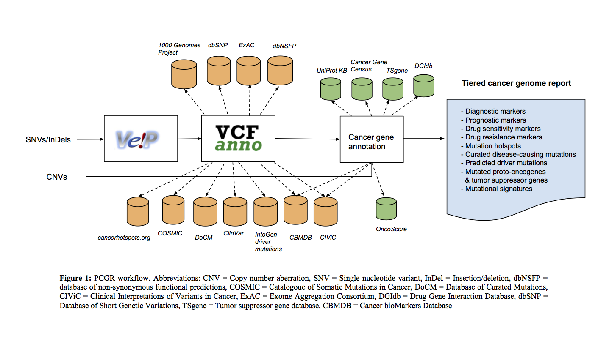

## Personal Cancer Genome Reporter (PCGR)- variant interpretation report for precision oncology

### Overview

The Personal Cancer Genome Reporter (PCGR) is a stand-alone software package for functional annotation and translation of individual cancer genomes for precision oncology. It interprets both somatic SNVs/InDels and copy number aberrations. The software extends basic gene and variant annotations from the [Ensembl’s Variant Effect Predictor (VEP)](http://www.ensembl.org/info/docs/tools/vep/index.html) with oncology-relevant, up-to-date annotations retrieved flexibly through [vcfanno](https://github.com/brentp/vcfanno), and produces interactive HTML reports intended for clinical interpretation.

### News
* _Nov 27th 2018_: **0.7.0 release**
   * Bundle update and bug fixing (see [CHANGELOG](http://pcgr.readthedocs.io/en/latest/CHANGELOG.html#nov-27th-2018) )
   * Reporting germline variants for cancer predisposition? Check out [github.com/sigven/cpsr](https://github.com/sigven/cpsr)
* _May 14th 2018_: **0.6.2.1 release**
   * [CHANGELOG](http://pcgr.readthedocs.io/en/latest/CHANGELOG.html#may-14th-2018)
* _May 9th 2018_: **0.6.2 release**
   * Fixed various bugs reported by users (see [CHANGELOG](http://pcgr.readthedocs.io/en/latest/CHANGELOG.html#may-9th-2018))
   * Data bundle update (ClinVar, KEGG, CIViC, UniProt, DiseaseOntology)
* _May 2nd 2018_: **0.6.1 release**
   * Fixed [bugs](http://pcgr.readthedocs.io/en/latest/CHANGELOG.html#may-2nd-2018) in tier assignment
* _April 25th 2018_: **0.6.0 release**
   * Updated data sources
   * Enabling specification of tumor type of input sample
   * New tier system for classification of variants (ACMG-like)
   * VCF validation can be turned off
   * Tumor DP/AF presets
   * JSON dump of report content
   * GRCh38 support
   * Runs under Python3
* _November 29th 2017_: **0.5.3 release**
   * Fixed bug with propagation of default options
* _November 23rd 2017_: **0.5.2 release**
* _November 15th 2017_: **0.5.1 pre-release**
  * Bug fixing (VCF validation)
* _November 14th 2017_: **0.5.0 pre-release**
  * Updated version of VEP (v90)
  * Updated versions of ClinVar, Uniprot KB, CIViC, CBMDB
  * Removal of ExAC (replaced by gnomAD), removal of COSMIC due to licensing restrictions
  * Users can analyze samples run without matching control (i.e. tumor-only)
  * PCGR pipeline is now configured through a [TOML-based configuration file](https://github.com/toml-lang/toml)
  * Bug fixes / general speed improvements
  * _Work in progress: Export of report data through JSON_

### Example reports
* [Report for a breast tumor sample (TCGA)](http://folk.uio.no/sigven/tumor_sample.BRCA.pcgr_acmg.grch37.dev.html)
* [Report for a colon adenocarcinoma sample (TCGA)](http://folk.uio.no/sigven/tumor_sample.COAD.pcgr_acmg.grch37.dev.html)

### PCGR documentation

**IMPORTANT**: If you use PCGR, please cite the publication:

Sigve Nakken, Ghislain Fournous, Daniel Vodák, Lars Birger Aaasheim, Ola Myklebost, and Eivind Hovig. __Personal Cancer Genome Reporter: variant interpretation report for precision oncology__ (2017). _Bioinformatics_. 34(10):1778–1780. doi:[10.1093/bioinformatics/btx817](https://doi.org/10.1093/bioinformatics/btx817)

### Annotation resources included in PCGR

* [VEP v94](http://www.ensembl.org/info/docs/tools/vep/index.html) - Variant Effect Predictor (GENCODE v28/v19 as the gene reference dataset)
* [CIViC](http://civic.genome.wustl.edu) - Clinical interpretations of variants in cancer (November 12th 2018)
* [ClinVar](http://www.ncbi.nlm.nih.gov/clinvar/) - Database of variants with clinical significance (November 2018)
* [DoCM](http://docm.genome.wustl.edu) - Database of curated mutations (v3.2, April 2016)
* [CBMDB](http://www.cancergenomeinterpreter.org/biomarkers) - Cancer Biomarkers database (January 17th 2018)
* [IntOGen catalog of driver mutations](https://www.intogen.org/downloads) - (May 2016)
* [DisGeNET](http://www.disgenet.org) - Database of gene-tumor type associations (May 2017)
* [Cancer Hotspots](http://cancerhotspots.org) - Resource for statistically significant mutations in cancer (v2 - 2017)
* [dBNSFP v3.5](https://sites.google.com/site/jpopgen/dbNSFP) - Database of non-synonymous functional predictions (August 2017)
* [TCGA release 13](https://portal.gdc.cancer.gov/) - somatic mutations discovered across 33 tumor type cohorts (The Cancer Genome Atlas)
* [UniProt/SwissProt KnowledgeBase 2018_10](http://www.uniprot.org) - Resource on protein sequence and functional information (November 2018)
* [Pfam v32](http://pfam.xfam.org) - Database of protein families and domains (September 2018)
* [DGIdb](http://dgidb.genome.wustl.edu) - Database of targeted cancer drugs  (v3.0.2, January 2018)
* [ChEMBL](https://www.ebi.ac.uk/chembl/) - Manually curated database of bioactive molecules (v24.1, June 2018)
* [CancerMine v6](https://zenodo.org/record/1481254#.W-nN-3pKiL4) - Literature-derived database of tumor suppressor genes/proto-oncogenes (November 2018)

### Getting started

#### STEP 0: Python

An installation of Python (version _3.6_) is required to run PCGR. Check that Python is installed by typing `python --version` in your terminal window. In addition, a [Python library](https://github.com/uiri/toml) for parsing configuration files encoded with [TOML](https://github.com/toml-lang/toml) is needed. To install, simply run the following command:

   	pip install toml

#### STEP 1: Installation of Docker

1. [Install the Docker engine](https://docs.docker.com/engine/installation/) on your preferred platform
   - installing [Docker on Linux](https://docs.docker.com/engine/installation/linux/)
   - installing [Docker on Mac OS](https://docs.docker.com/engine/installation/mac/)
   - NOTE: We have not yet been able to perform enough testing on the Windows platform, and we have received feedback that particular versions of Docker/Windows do not work with PCGR (an example being [mounting of data volumes](https://github.com/docker/toolbox/issues/607))
2. Test that Docker is running, e.g. by typing `docker ps` or `docker images` in the terminal window
3. Adjust the computing resources dedicated to the Docker, i.e.:
   - Memory: minimum 5GB
   - CPUs: minimum 4
   - [How to - Mac OS X](https://docs.docker.com/docker-for-mac/#advanced)

#### STEP 2: Download PCGR and data bundle

##### Development version

a. Clone the PCGR GitHub repository (includes run script and configuration file): `git clone https://github.com/sigven/pcgr.git`

b. Download and unpack the latest data bundles in the PCGR directory
   * [grch37 data bundle - 20181119](https://drive.google.com/open?id=1OL5C994HDaeadASz7KzMhPoXfdSiyhNy) (approx 9Gb)
   * [grch38 data bundle - 20181119](https://drive.google.com/open?id=1CZNc87E0K5AK2RDSNU57FqLp0H1skpUh) (approx 14Gb)
   * *Unpacking*: `gzip -dc pcgr.databundle.grch37.YYYYMMDD.tgz | tar xvf -`

c. Pull the [PCGR Docker image (*dev*)](https://hub.docker.com/r/sigven/pcgr/) from DockerHub (approx 5.1Gb):
* `docker pull sigven/pcgr:dev` (PCGR annotation engine)

##### Latest release

a. Download and unpack the [latest software release (0.7.0)](https://github.com/sigven/pcgr/releases/tag/v0.7.0)

b. Download and unpack the assembly-specific data bundle in the PCGR directory
   * [grch37 data bundle - 20181119](https://drive.google.com/open?id=1OL5C994HDaeadASz7KzMhPoXfdSiyhNy) (approx 9Gb)
   * [grch38 data bundle - 20181119](https://drive.google.com/open?id=1CZNc87E0K5AK2RDSNU57FqLp0H1skpUh) (approx 14Gb)
   * *Unpacking*: `gzip -dc pcgr.databundle.grch37.YYYYMMDD.tgz | tar xvf -`

    A _data/_ folder within the _pcgr-X.X_ software folder should now have been produced

c. Pull the [PCGR Docker image (0.7.0)](https://hub.docker.com/r/sigven/pcgr/) from DockerHub (approx 5.1Gb):
   * `docker pull sigven/pcgr:0.7.0` (PCGR annotation engine)

#### STEP 3: Input preprocessing

The PCGR workflow accepts two types of input files:

  * An unannotated, single-sample VCF file (>= v4.2) with called somatic variants (SNVs/InDels)
  * A copy number segment file

PCGR can be run with either or both of the two input files present.

* We __strongly__ recommend that the input VCF is compressed and indexed using [bgzip](http://www.htslib.org/doc/tabix.html) and [tabix](http://www.htslib.org/doc/tabix.html)
* If the input VCF contains multi-allelic sites, these will be subject to [decomposition](http://genome.sph.umich.edu/wiki/Vt#Decompose)
* Variants used for reporting should be designated as 'PASS' in the VCF FILTER column

The tab-separated values file with copy number aberrations __MUST__ contain the following four columns:
* Chromosome
* Start
* End
* Segment_Mean

Here, _Chromosome_, _Start_, and _End_ denote the chromosomal segment, and __Segment_Mean__ denotes the log(2) ratio for a particular segment, which is a common output of somatic copy number alteration callers. Note that coordinates must be **one-based** (i.e. chromosomes start at 1, not 0). Below shows the initial part of a copy number segment file that is formatted correctly according to PCGR's requirements:

    Chromosome	Start	End	Segment_Mean
    1 3218329 3550598 0.0024
    1 3552451 4593614 0.1995
    1 4593663 6433129 -1.0277

#### STEP 4: Configure PCGR

The PCGR configuration file, formatted using [TOML](https://github.com/toml-lang/toml) (an easy to read file format) enables the user to configure a number of options in the PCGR workflow, related to the following:

* Tumor type of input sample
* Tier model
* Sequencing depth/allelic support thresholds
* MSI prediction
* Mutational signatures analysis
* Mutational burden analysis (e.g. target size)
* VCF to MAF conversion
* Tumor-only analysis options (i.e. exclusion of germline variants/enrichment for somatic calls)
* VEP/_vcfanno_ options
* Log-ratio thresholds for gains/losses in CNA analysis

See here for more details about the exact [usage of the configuration options](http://pcgr.readthedocs.io/en/latest/input.html#pcgr-configuration-file).

The PCGR software bundle comes with a default configuration file (*pcgr.toml*), to be used as a starting point for runnning the PCGR workflow.

#### STEP 5: Run example

A tumor sample report is generated by calling the Python script __pcgr.py__, which takes the following arguments and options:

	usage: pcgr.py [-h] [--input_vcf INPUT_VCF] [--input_cna INPUT_CNA]
			[--force_overwrite] [--version] [--basic]
			[--docker-uid DOCKER_USER_ID] [--no-docker]
			pcgr_dir output_dir {grch37,grch38} configuration_file
			sample_id

	Personal Cancer Genome Reporter (PCGR) workflow for clinical interpretation of
	somatic nucleotide variants and copy number aberration segments

	positional arguments:
	pcgr_dir              PCGR base directory with accompanying data directory,
				    e.g. ~/pcgr-0.7.0
	output_dir            Output directory
	{grch37,grch38}       Genome assembly build: grch37 or grch38
	configuration_file    PCGR configuration file (TOML format)
	sample_id             Tumor sample/cancer genome identifier - prefix for
				    output files

	optional arguments:
	-h, --help            show this help message and exit
	--input_vcf INPUT_VCF
				    VCF input file with somatic query variants
				    (SNVs/InDels). (default: None)
	--input_cna INPUT_CNA
				    Somatic copy number alteration segments (tab-separated
				    values) (default: None)
	--force_overwrite     By default, the script will fail with an error if any
				    output file already exists. You can force the
				    overwrite of existing result files by using this flag
				    (default: False)
	--version             show program's version number and exit
	--basic               Run functional variant annotation on VCF through
				    VEP/vcfanno, omit other analyses (i.e. CNA, MSI,
				    report generation etc. (STEP 4) (default: False)
	--docker-uid DOCKER_USER_ID
				    Docker user ID. Default is the host system user ID. If
				    you are experiencing permission errors, try setting
				    this up to root (`--docker-uid root`) (default: None)
	--no-docker           Run the PCGR workflow in a non-Docker mode (see
				    install_no_docker/ folder for instructions (default:
				    False)

The _examples_ folder contain input files from two tumor samples sequenced within TCGA (**GRCh37** only). It also contains PCGR configuration files customized for these cases. A report for a colorectal tumor case can be generated by running the following command in your terminal window:

`python pcgr.py --input_vcf ~/pcgr-0.7.0/examples/tumor_sample.COAD.vcf.gz`
`--input_cna ~/pcgr-0.7.0/examples/tumor_sample.COAD.cna.tsv`
` ~/pcgr-0.7.0 ~/pcgr-0.7.0/examples grch37 ~/pcgr-0.7.0/examples/pcgr_conf.COAD.toml tumor_sample.COAD`

This command will run the Docker-based PCGR workflow and produce the following output files in the _examples_ folder:

  1. __tumor_sample.COAD.pcgr_acmg.grch37.html__ - An interactive HTML report for clinical interpretation
  2. __tumor_sample.COAD.pcgr_acmg.grch37.pass.vcf.gz__ - Bgzipped VCF file with rich set of annotations for precision oncology
  3. __tumor_sample.COAD.pcgr_acmg.grch37.pass.tsv.gz__ - Compressed vcf2tsv-converted file with rich set of annotations for precision oncology
  4. __tumor_sample.COAD.pcgr_acmg.grch37.snvs_indels.tiers.tsv__ - Tab-separated values file with variants organized according to tiers of functional relevance
  5. __tumor_sample.COAD.pcgr_acmg.grch37.json.gz__ - Compressed JSON dump of HTML report content
  6. __tumor_sample.COAD.pcgr_acmg.grch37.cna_segments.tsv.gz__ - Compressed tab-separated values file with annotations of gene transcripts that overlap with somatic copy number aberrations

## Contact

sigven@ifi.uio.no
