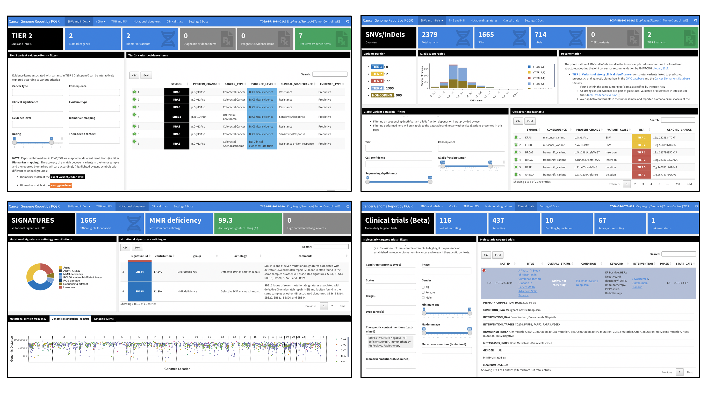

## Personal Cancer Genome Reporter (PCGR) - variant interpretation for precision cancer medicine

### Contents

- [Overview](#overview)
- [News](#news)
- [Example reports](#example-reports)
- [PCGR Documentation](#documentation)
- [Annotation resources](#annotation-resources-included-in-pcgr---092)
- [Getting started](#getting-started)
- [FAQ](#faq)
- [Contact](#contact)

### Overview

The Personal Cancer Genome Reporter (PCGR) is a stand-alone software package for functional annotation and translation of individual cancer genomes for precision cancer medicine. Currently, it interprets both somatic SNVs/InDels and copy number aberrations. The software extends basic gene and variant annotations from the [Ensembl’s Variant Effect Predictor (VEP)](http://www.ensembl.org/info/docs/tools/vep/index.html) with oncology-relevant, up-to-date annotations retrieved flexibly through [vcfanno](https://github.com/brentp/vcfanno), and produces interactive HTML reports intended for clinical interpretation. __NOTE__: If you want to generate a personal report with respect to cancer predisposition for germline variants, try the accompanying tool [Cancer Predisposition Sequencing Reporter (CPSR)](https://github.com/sigven/cpsr).

A few screenshots of the dashboard-type HTML output (new in 0.9.0) is shown below.

### News
* _December 2021_: **0.9.3 release**
  * Complete restructure of Python and R components. 
  * Remove VCF validation step. Feedback from users suggested that Ensembl's
    `vcf-validator` was often too stringent so its use has been deprecated.
    The `--no_vcf_validate` option remains for backwards compatibility.
* _June 30th 2021_: **0.9.2 release**
   * Data bundle updates (CIViC, ClinVar, CancerMine, UniProt KB, PFAM)
   * Software upgrades: VEP (104), R v4.1/BioConductor 3.13
   * **NEW**: TOML configuration removed - all options to PCGR are now command-line based
   * **NEW**: Feed PCGR with a [CPSR report](https://github.com/sigven/cpsr) to view key germline findings in the tumor report
   * [CHANGELOG](http://pcgr.readthedocs.io/en/latest/CHANGELOG.html)
   * Planned for next release: Support for analysis of RNA fusions
* _November 30th 2020_: **0.9.1 release**
   * Data bundle updates (CIViC, ClinVar, CancerMine, UniProt KB)
   * [CHANGELOG](http://pcgr.readthedocs.io/en/latest/CHANGELOG.html)

### Example reports

### PCGR documentation

  &nbsp; 

**IMPORTANT**: If you use PCGR, please cite the publication:

Sigve Nakken, Ghislain Fournous, Daniel Vodák, Lars Birger Aaasheim, Ola Myklebost, and Eivind Hovig. __Personal Cancer Genome Reporter: variant interpretation report for precision oncology__ (2017). _Bioinformatics_. 34(10):1778–1780. doi:[10.1093/bioinformatics/btx817](https://doi.org/10.1093/bioinformatics/btx817)

### Annotation resources included in PCGR - 0.9.2

* [VEP](http://www.ensembl.org/info/docs/tools/vep/index.html) - Variant Effect Predictor v104 (GENCODE v38/v19 as the gene reference dataset)
* [CIViC](http://civic.genome.wustl.edu) - Clinical interpretations of variants in cancer (June 15th 2021)
* [ClinVar](http://www.ncbi.nlm.nih.gov/clinvar/) - Database of variants with clinical significance (June 2021)
* [DoCM](http://docm.genome.wustl.edu) - Database of curated mutations (v3.2, Apr 2016)
* [CGI](http://www.cancergenomeinterpreter.org/biomarkers) - Cancer Biomarkers database (Jan 17th 2018)
* [Cancer Hotspots](http://cancerhotspots.org) - Resource for statistically significant mutations in cancer (v2 - 2017)
* [dBNSFP](https://sites.google.com/site/jpopgen/dbNSFP) - Database of non-synonymous functional predictions (v4.2, March 2021)
* [TCGA](https://portal.gdc.cancer.gov/) - somatic mutations discovered across 33 tumor type cohorts (The Cancer Genome Atlas (TCGA), release 29, March 2021)
* [CHASMplus](https://karchinlab.github.io/CHASMplus/) - predicted driver mutations across 33 tumor type cohorts in TCGA
* [UniProt/SwissProt KnowledgeBase](http://www.uniprot.org) - Resource on protein sequence and functional information (2021_03, June 2021)
* [Pfam](http://pfam.xfam.org) - Database of protein families and domains (v34, March 2021)
* [Open Targets Platform](https://targetvalidation.org) - Target-disease and target-drug associations  (2021_04, April 2021)
* [ChEMBL](https://www.ebi.ac.uk/chembl/) - Manually curated database of bioactive molecules (v28, February 2021)
* [CancerMine](https://zenodo.org/record/4270451#.X7t43qpKiHE) - Literature-mined database of tumor suppressor genes/proto-oncogenes (v36, June 2021)

### Getting started

#### STEP 0: Python

An installation of Python (version _3.6_) is required to run PCGR. Check that Python is installed by typing `python --version` in your terminal window.

**IMPORTANT NOTE**: STEP 1 & 2 below outline installation guidelines for running PCGR with Docker. If you want to install and run PCGR without the use of Docker (i.e. through Conda), follow [these instructions](https://github.com/sigven/pcgr/blob/master/install_no_docker/README.md)

#### STEP 1: Installation of Docker

1. [Install the Docker engine](https://docs.docker.com/engine/installation/) on your preferred platform
   - installing [Docker on Linux](https://docs.docker.com/engine/installation/linux/)
   - installing [Docker on Mac OS](https://docs.docker.com/engine/installation/mac/)
   - NOTE: We have not yet been able to perform enough testing on the Windows platform, and we have received feedback that particular versions of Docker/Windows do not work with PCGR (an example being [mounting of data volumes](https://github.com/docker/toolbox/issues/607))
2. Test that Docker is running, e.g. by typing `docker ps` or `docker images` in the terminal window
3. Adjust the computing resources dedicated to the Docker, i.e.:
   - Memory: minimum 5GB
   - CPUs: minimum 4
   - [How to - Mac OS X](https://docs.docker.com/docker-for-mac/#advanced)

#### STEP 2: Download PCGR and data bundle

##### Latest release

a. Download and unpack the [latest software release (0.9.2)](https://github.com/sigven/pcgr/releases/tag/v0.9.2)

b. Download and unpack the assembly-specific data bundle in the PCGR directory
  * [grch37 data bundle - 20210627](http://insilico.hpc.uio.no/pcgr/pcgr.databundle.grch37.20210627.tgz) (approx 20Gb)
  * [grch38 data bundle - 20210627](http://insilico.hpc.uio.no/pcgr/pcgr.databundle.grch38.20210627.tgz) (approx 21Gb)
     * *Unpacking*: `gzip -dc pcgr.databundle.grch37.YYYYMMDD.tgz | tar xvf -`

    A _data/_ folder within the _pcgr-X.X_ software folder should now have been produced

c. Pull the [PCGR Docker image (0.9.2)](https://hub.docker.com/r/sigven/pcgr/) from DockerHub (approx 5.0Gb):
   * `docker pull sigven/pcgr:0.9.2` (PCGR annotation engine)

##### Development version

a. Clone the PCGR GitHub repository (includes run script and default configuration file): `git clone https://github.com/sigven/pcgr.git`

b. Download and unpack the latest data bundles in the PCGR directory
   * [grch37 data bundle - 20210627](http://insilico.hpc.uio.no/pcgr/pcgr.databundle.grch37.20210627.tgz) (approx 20Gb)
   * [grch38 data bundle - 20210627](http://insilico.hpc.uio.no/pcgr/pcgr.databundle.grch38.20210627.tgz) (approx 21Gb)
	   * If our local server cannot be reached or is non-responding, try [grch37 - Google Drive](https://drive.google.com/file/d/13CFmG3Nd0P73OXbF__P9w6iJ-tcAATzB/view?usp=sharing) / [grch38 - Google Drive](https://drive.google.com/file/d/1cYgnL3jPe_r7Fp625zPgMmKols99twu1/view?usp=sharing)
   * *Unpacking*: `gzip -dc pcgr.databundle.grch37.YYYYMMDD.tgz | tar xvf -`

c. Pull the [PCGR Docker image (*dev*)](https://hub.docker.com/r/sigven/pcgr/) from DockerHub (approx 5.0Gb):
* `docker pull sigven/pcgr:dev` (PCGR annotation engine)

#### STEP 3: Input preprocessing

The PCGR workflow accepts two types of input files:

  * An unannotated, single-sample VCF file (>= v4.2) with called somatic variants (SNVs/InDels) - __required__
  * A copy number segment file - __optional__

* We __strongly__ recommend that the input VCF is compressed and indexed using [bgzip](http://www.htslib.org/doc/tabix.html) and [tabix](http://www.htslib.org/doc/tabix.html)
* If the input VCF contains multi-allelic sites, these will be subject to [decomposition](http://genome.sph.umich.edu/wiki/Vt#Decompose). Optimally, try to decompose multi-allelic variants in the input VCF prior to analysis.
* Variants used for reporting should be designated as 'PASS' in the VCF FILTER column

The tab-separated values file with copy number aberrations __MUST__ contain the following four columns:
* Chromosome
* Start
* End
* Segment_Mean

Here, _Chromosome_, _Start_, and _End_ denote the chromosomal segment, and __Segment_Mean__ denotes the log(2) ratio for a particular segment, which is a common output of somatic copy number alteration callers. Note that coordinates must be **one-based** (i.e. chromosomes start at 1, not 0). Below shows the initial part of a copy number segment file that is formatted correctly according to PCGR's requirements:

    Chromosome	Start	End	Segment_Mean
    1 3218329 3550598 0.0024
    1 3552451 4593614 0.1995
    1 4593663 6433129 -1.0277

#### STEP 4: Configure your PCGR workflow

The PCGR software comes with a range of options to configure the report and analysis, depending on the type of sequencing assay (__tumor-control__ vs. __tumor_only__), types of data available (SNVs/InDels, copy number aberration) etc.

* __IMPORTANT__: Proper designation of VCF INFO tags that denote variant depth/allelic fraction is critical to make the report as comprehensive as possible (options `--tumor_dp_tag`, `tumor_af_tag`,`--control_dp_tag`,`--control_af_tag`, and `--call_conf_tag`)
    * If this is not available/properly set, the report contents will be less informative __AND__ it will not be possible to preset thresholds for variant depth/allelic fraction

Furthermore, to make the report as complete as possible, take a note of the following arguments which can be used in the report generation:

  * Tumor purity estimate (`--tumor_ploidy`, for display only)
  * Tumor ploidy estimate (`--tumor_purity`, for display only)
  * Type of sequencing assay (`--assay`)
  * Cell line sample (`--cell_line`, for display only)
  * Coding target size of sequencing assay (`--target_size_mb`)

#### STEP 5: Run example

A tumor sample report is generated by calling the Python script __pcgr.py__, which takes the following arguments and options:

	usage:
	pcgr.py -h [options]
	--input_vcf <INPUT_VCF>
	--pcgr_dir <PCGR_DIR>
	--output_dir <OUTPUT_DIR>
	--genome_assembly <GENOME_ASSEMBLY>
	--sample_id <SAMPLE_ID>

	Personal Cancer Genome Reporter (PCGR) workflow for clinical interpretation of somatic nucleotide variants and copy number aberration segments

	Required arguments:
	--input_vcf INPUT_VCF
				    VCF input file with somatic variants in tumor sample, SNVs/InDels
	--pcgr_dir PCGR_DIR   PCGR base directory with accompanying data directory, e.g. ~/pcgr-0.9.2
	--output_dir OUTPUT_DIR
				    Output directory
	--genome_assembly {grch37,grch38}
				    Human genome assembly build: grch37 or grch38
	--sample_id SAMPLE_ID
				    Tumor sample/cancer genome identifier - prefix for output files

	vcfanno options:
	--vcfanno_n_proc VCFANNO_N_PROC
				    Number of vcfanno processes (option '-p' in vcfanno), default: 4

	VEP options:
	--vep_n_forks VEP_N_FORKS
				    Number of forks (option '--fork' in VEP), default: 4
	--vep_buffer_size VEP_BUFFER_SIZE
				    Variant buffer size (variants read into memory simultaneously, option '--buffer_size' in VEP)
				    - set lower to reduce memory usage, default: 100
	--vep_pick_order VEP_PICK_ORDER
				    Comma-separated string of ordered transcript/variant properties for selection of primary variant consequence
					( option '--pick_order' in VEP), default: canonical,appris,biotype,ccds,rank,tsl,length,mane
	--vep_no_intergenic   Skip intergenic variants during processing (option '--no_intergenic' in VEP), default: False
	--vep_regulatory      Add VEP regulatory annotations (option '--regulatory' )or non-coding interpretation, default: False

	Tumor mutational burden (TMB) and MSI options:
	--target_size_mb TARGET_SIZE_MB
				    For mutational burden analysis - approximate protein-coding target size in Mb of sequencing assay (default: 34 (WES/WGS))
	--estimate_tmb        Estimate tumor mutational burden from the total number of somatic mutations and target region size, default: False
	--estimate_msi_status
				    Predict microsatellite instability status from patterns of somatic mutations/indels, default: False
	--tmb_algorithm {all_coding,nonsyn}
				    Method for calculation of TMB, all coding variants (Chalmers et al., Genome Medicine, 2017), or non-synonymous variants only, default: all_coding

	Mutatonal signature options:
	--estimate_signatures
				    Estimate relative contributions of reference mutational signatures in query sample and detect potential kataegis events, default: False
	--min_mutations_signatures MIN_MUTATIONS_SIGNATURES
				    Minimum number of SNVs required for reconstruction of mutational signatures (SBS) by MutationalPatterns (default: 200, minimum n = 100)
	--all_reference_signatures
				    Use all reference mutational signatures (SBS, n = 67) in signature reconstruction rather than only those already attributed to the tumor type (default: False)
	--include_artefact_signatures
				    Include sequencing artefacts in the collection of reference signatures (default: False

	Tumor-only options:
	--tumor_only          Input VCF comes from tumor-only sequencing, calls will be filtered for variants of germline origin, (default: False)
	--cell_line           Input VCF comes from tumor cell line sequencing (requires --tumor_only), calls will be filtered for variants of germline origin, (default: False)
	--pon_vcf PON_VCF     VCF file with germline calls from Panel of Normals (PON) - i.e. blacklisted variants, (default: None)
	--maf_onekg_eur MAF_ONEKG_EUR
				    Exclude variants in tumor (SNVs/InDels, tumor-only mode) with MAF above the given percent threshold (1000 Genomes Project - European pop, default: 0.002)
	--maf_onekg_amr MAF_ONEKG_AMR
				    Exclude variants in tumor (SNVs/InDels, tumor-only mode) with MAF above the given percent threshold (1000 Genomes Project - Ad Mixed American pop, default: 0.002)
	--maf_onekg_afr MAF_ONEKG_AFR
				    Exclude variants in tumor (SNVs/InDels, tumor-only mode) with MAF above the given percent threshold (1000 Genomes Project - African pop, default: 0.002)
	--maf_onekg_eas MAF_ONEKG_EAS
				    Exclude variants in tumor (SNVs/InDels, tumor-only mode) with MAF above the given percent threshold (1000 Genomes Project - East Asian pop, default: 0.002)
	--maf_onekg_sas MAF_ONEKG_SAS
				    Exclude variants in tumor (SNVs/InDels, tumor-only mode) with MAF above the given percent threshold (1000 Genomes Project - South Asian pop, default: 0.002)
	--maf_onekg_global MAF_ONEKG_GLOBAL
				    Exclude variants in tumor (SNVs/InDels, tumor-only mode) with MAF above the given percent threshold (1000 Genomes Project - global pop, default: 0.002)
	--maf_gnomad_nfe MAF_GNOMAD_NFE
				    Exclude variants in tumor (SNVs/InDels, tumor-only mode) with MAF above the given percent threshold, (gnomAD - European (non-Finnish), default: 0.002)
	--maf_gnomad_asj MAF_GNOMAD_ASJ
				    Exclude variants in tumor (SNVs/InDels, tumor-only mode) with MAF above the given percent threshold, (gnomAD - Ashkenazi Jewish, default: 0.002)
	--maf_gnomad_fin MAF_GNOMAD_FIN
				    Exclude variants in tumor (SNVs/InDels, tumor-only mode) with MAF above the given percent threshold, (gnomAD - European (Finnish), default: 0.002)
	--maf_gnomad_oth MAF_GNOMAD_OTH
				    Exclude variants in tumor (SNVs/InDels, tumor-only mode) with MAF above the given percent threshold, (gnomAD - Other, default: 0.002)
	--maf_gnomad_amr MAF_GNOMAD_AMR
				    Exclude variants in tumor (SNVs/InDels, tumor-only mode) with MAF above the given percent threshold, (gnomAD - Latino/Admixed American, default: 0.002)
	--maf_gnomad_afr MAF_GNOMAD_AFR
				    Exclude variants in tumor (SNVs/InDels, tumor-only mode) with MAF above the given percent threshold, (gnomAD - African/African-American, default: 0.002)
	--maf_gnomad_eas MAF_GNOMAD_EAS
				    Exclude variants in tumor (SNVs/InDels, tumor-only mode) with MAF above the given percent threshold, (gnomAD - East Asian, default: 0.002)
	--maf_gnomad_sas MAF_GNOMAD_SAS
				    Exclude variants in tumor (SNVs/InDels, tumor-only mode) with MAF above the given percent threshold, (gnomAD - South Asian, default: 0.002)
	--maf_gnomad_global MAF_GNOMAD_GLOBAL
				    Exclude variants in tumor (SNVs/InDels, tumor-only mode) with MAF above the given percent threshold, (gnomAD - global population, default: 0.002)
	--exclude_pon         Exclude variants occurring in PoN (Panel of Normals, if provided as VCF (--pon_vcf), default: False)
	--exclude_likely_hom_germline
				    Exclude likely homozygous germline variants (100 pct allelic fraction for alternate allele in tumor, very unlikely somatic event, default: False)
	--exclude_likely_het_germline
				    Exclude likely heterozygous germline variants (40-60 pct allelic fraction, AND presence in dbSNP + gnomAD, AND not existing as somatic event in COSMIC/TCGA, default: False)
	--exclude_dbsnp_nonsomatic
				    Exclude variants found in dbSNP (only those that are NOT found in ClinVar(somatic origin)/DoCM/TCGA/COSMIC, defult: False)
	--exclude_nonexonic   Exclude non-exonic variants, defult: False)

	Allelic support options:
	--tumor_dp_tag TUMOR_DP_TAG
				    Specify VCF INFO tag for sequencing depth (tumor, must be Type=Integer, default: _NA_
	--tumor_af_tag TUMOR_AF_TAG
				    Specify VCF INFO tag for variant allelic fraction (tumor,  must be Type=Float, default: _NA_
	--control_dp_tag CONTROL_DP_TAG
				    Specify VCF INFO tag for sequencing depth (control, must be Type=Integer, default: _NA_
	--control_af_tag CONTROL_AF_TAG
				    Specify VCF INFO tag for variant allelic fraction (control, must be Type=Float, default: _NA_
	--call_conf_tag CALL_CONF_TAG
				    Specify VCF INFO tag for somatic variant call confidence (must be categorical, e.g. Type=String, default: _NA_
	--tumor_dp_min TUMOR_DP_MIN
				    If VCF INFO tag for sequencing depth (tumor) is specified and found, set minimum required depth for inclusion in report (default: 0)
	--tumor_af_min TUMOR_AF_MIN
				    If VCF INFO tag for variant allelic fraction (tumor) is specified and found, set minimum required AF for inclusion in report (default: 0)
	--control_dp_min CONTROL_DP_MIN
				    If VCF INFO tag for sequencing depth (control) is specified and found, set minimum required depth for inclusion in report (default: 0)
	--control_af_max CONTROL_AF_MAX
				    If VCF INFO tag for variant allelic fraction (control) is specified and found, set maximum tolerated AF for inclusion in report (default: 1)

	Other options:
	--input_cna INPUT_CNA
				    Somatic copy number alteration segments (tab-separated values)
	--logr_gain LOGR_GAIN
				    Log ratio-threshold for regions containing copy number gains/amplifications (default: 0.8)
	--logr_homdel LOGR_HOMDEL
				    Log ratio-threshold for regions containing homozygous deletions (default: -0.8)
	--cna_overlap_pct CNA_OVERLAP_PCT
				    Mean percent overlap between copy number segment and gene transcripts for reporting of gains/losses in tumor suppressor genes/oncogenes, (default: 50)
	--tumor_site TSITE    Optional integer code to specify primary tumor type/site of query sample,
					choose any of the following identifiers:
				    1 = Adrenal Gland
				    2 = Ampulla of Vater
				    3 = Biliary Tract
				    4 = Bladder/Urinary Tract
				    5 = Bone
				    6 = Breast
				    7 = Cervix
				    8 = CNS/Brain
				    9 = Colon/Rectum
				    10 = Esophagus/Stomach
				    11 = Eye
				    12 = Head and Neck
				    13 = Kidney
				    14 = Liver
				    15 = Lung
				    16 = Lymphoid
				    17 = Myeloid
				    18 = Ovary/Fallopian Tube
				    19 = Pancreas
				    20 = Peripheral Nervous System
				    21 = Peritoneum
				    22 = Pleura
				    23 = Prostate
				    24 = Skin
				    25 = Soft Tissue
				    26 = Testis
				    27 = Thymus
				    28 = Thyroid
				    29 = Uterus
				    30 = Vulva/Vagina
				    (default: 0 - any tumor type)
	--tumor_purity TUMOR_PURITY
				    Estimated tumor purity (between 0 and 1, (default: None)
	--tumor_ploidy TUMOR_PLOIDY
				    Estimated tumor ploidy (default: None)
	--cpsr_report CPSR_REPORT
				    CPSR report file (Gzipped JSON - file ending with 'cpsr.<genome_assembly>.json.gz' -  germline report of patient's blood/control sample
	--vcf2maf             Generate a MAF file for input VCF using https://github.com/mskcc/vcf2maf (default: False)
	--show_noncoding      List non-coding (i.e. non protein-altering) variants in report, default: False
	--assay {WES,WGS,TARGETED}
				    Type of DNA sequencing assay performed for input data (VCF) default: WES
	--include_trials      (Beta) Include relevant ongoing or future clinical trials, focusing on studies with molecularly targeted interventions
	--preserved_info_tags PRESERVED_INFO_TAGS
				    Comma-separated string of VCF INFO tags from query VCF that should be kept in PCGR output TSV file
	--report_theme {default,cerulean,journal,flatly,readable,spacelab,united,cosmo,lumen,paper,sandstone,simplex,yeti}
				    Visual report theme (rmarkdown)
	--report_nonfloating_toc
				    Do not float the table of contents (TOC) in output report (rmarkdown), default: False
	--force_overwrite     By default, the script will fail with an error if any output file already exists. You can force the overwrite of existing result files by using this flag, default: False
	--version             show program's version number and exit
	--basic               Run functional variant annotation on VCF through VEP/vcfanno, omit other analyses (i.e. Tier assignment/MSI/TMB/Signatures etc. and report generation (STEP 4), default: False
	--no_vcf_validate     Skip validation of input VCF with Ensembl's vcf-validator, default: False
	--docker_uid DOCKER_USER_ID
				    Docker user ID. default is the host system user ID. If you are experiencing permission errors, try setting this up to root (`--docker-uid root`)
	--no_docker           Run the PCGR workflow in a non-Docker mode (see install_no_docker/ folder for instructions)
	--debug               Print full Docker commands to log, default: False

The _examples_ folder contain input VCF files from two tumor samples sequenced within TCGA (**GRCh37** only). It also contains a PCGR configuration file customized for these VCFs. A report for a colorectal tumor case can be generated by running the following command in your terminal window:

	python ~/pcgr-0.9.2/pcgr.py
	--pcgr_dir ~/pcgr-0.9.2
	--output_dir ~/pcgr-0.9.2
	--sample_id tumor_sample.COAD
	--tumor_dp_tag TDP
	--tumor_af_tag TVAF
	--call_conf_tag TAL
	--genome_assembly grch37
	--input_vcf ~/pcgr-0.9.2/examples/tumor_sample.COAD.vcf.gz
	--tumor_site 9
	--input_cna ~/pcgr-0.9.2/examples/tumor_sample.COAD.cna.tsv
	--tumor_purity 0.9
	--tumor_ploidy 2.0
	--include_trials
	--assay WES
	--estimate_signatures
	--estimate_msi_status
	--estimate_tmb
	--no_vcf_validate

This command will run the Docker-based PCGR workflow and produce the following output files in the _examples_ folder:

1. __tumor_sample.COAD.pcgr_acmg.grch37.html__ - An interactive HTML report for clinical interpretation (rmarkdown)
2. __tumor_sample.COAD.pcgr_acmg.grch37.flexdb.html__ - An interactive HTML report for clinical interpretation (flexdashboard)
3. __tumor_sample.COAD.pcgr_acmg.grch37.vcf.gz (.tbi)__ - Bgzipped VCF file with rich set of annotations for precision oncology
4. __tumor_sample.COAD.pcgr_acmg.grch37.pass.vcf.gz (.tbi)__ - Bgzipped VCF file with rich set of annotations for precision oncology (PASS variants only)
5. __tumor_sample.COAD.pcgr_acmg.grch37.pass.tsv.gz__ - Compressed vcf2tsv-converted file with rich set of annotations for precision oncology
6. __tumor_sample.COAD.pcgr_acmg.grch37.snvs_indels.tiers.tsv__ - Tab-separated values file with variants organized according to tiers of functional relevance
7. __tumor_sample.COAD.pcgr_acmg.grch37.mutational_signatures.tsv__ - Tab-separated values file with information on contribution of mutational signatures
8. __tumor_sample.COAD.pcgr_acmg.grch37.json.gz__ - Compressed JSON dump of HTML report content
9. __tumor_sample.COAD.pcgr_acmg.grch37.cna_segments.tsv.gz__ - Compressed tab-separated values file with annotations of gene transcripts that overlap with somatic copy number aberrations

  ## FAQ

  Frequently asked questions regarding PCGR usage and functionality:

  __1. Why do I get a long list of lines with “ERROR: Line ..” during “STEP 0: validate input data”?__

  _Answer: Your query VCF does not pass the VCF validation check by_ [EBI's vcf-validator](https://github.com/EBIvariation/vcf-validator).
  _Solution: 1) Fix the VCF so that it adheres to the VCF standard, or 2) run PCGR with option `--vcf_no_validate` if you think the formatting problems is not critical to the contents of the VCF._

  __2. I am not sure how to specify depth/allelic fraction in my query VCF. Why cannot PCGR pull out this information automatically from my VCF file?__

  _Answer: This is something that you as a user need to handle yourself. To our knowledge, there is currently no standard way that variant callers format these types of data (allelic fraction/depth, tumor/normal) in the VCF, and this makes it very challenging for PCGR to automatically grab this information from the variety of VCFs produced by different variant callers. Please take a careful look at the example VCF files (`examples` folder) that comes with PCGR for how PCGR expects this information to be formatted, and make sure your VCF is formatted accordingly._

  __3. Is it possible to utilize PCGR for analysis of multiple samples?__

  _Answer: As the name of the tool implies, PCGR was developed for the detailed analysis of individual tumor samples. However, if you take advantage of the different outputs from PCGR, it can also be utilized for analysis of multiple samples. First, make sure your input files are organized per sample (i.e. one VCF file per sample, one CNA file per sample), so that they can be fed directly to PCGR. Now, once all samples have been processed with PCGR, note that all the tab-separated output files (i.e. tiers, mutational signatures, cna segments) contain the sample identifier, which enable them to be aggregated and suitable for a downstream multi-sample analysis._

  _Also note that the compressed JSON output pr. sample run contains __ALL__ information presented in the report. Explore the JSON contents e.g. with the_ [jsonlite package](https://github.com/jeroen/jsonlite) _in R:_

   `report_data <- jsonlite::fromJSON('<sample_id>.pcgr_acmg.grch37.json.gz')`

  _E.g. tiered SNV/InDel output_:

   `head(report_data$content$snv_indel$variant_set$tsv)`

  _Or TMB estimate_:

   `report_data$content$tmb$variant_statistic$tmb_estimate`

  __4. I do not see the expected transcript-specific consequence for a particular variant. In what way is the primary variant consequence established?__

  _Answer: PCGR relies upon_ [VEP](https://www.ensembl.org/info/docs/tools/vep/index.html)  _for consequence prioritization, in which a specific transcript-specific consequence is chosen as the primary variant consequence. In the PCGR configuration file, you may customise how this is chosen by changing the order of criteria applied when choosing a primary consequence block  - parameter_ [vep_pick_order](https://www.ensembl.org/info/docs/tools/vep/script/vep_other.html#pick_options)

  __5. Is it possible to use RefSeq as the underlying gene transcript model in PCGR?__

  _Answer: PCGR uses GENCODE as the primary gene transcript model, but we provide cross-references to corresponding RefSeq transcripts when this is available._

  __6. I have a VCF with structural variants detected in my tumor sample, can PCGR process those as well?__

  _Answer: This is currently not supported as input for PCGR, but is something we want to incorporate in the future._

  __7. I am surprised to see a particular gene being located in TIER 3 for my sample, since I know that this gene is of potential clinical significance in the tumor type I am investigating?__

  _Answer: PCGR classifies variants into tiers of significance through an implementation of_  [published guidelines by ACMG/AMP](https://pcgr.readthedocs.io/en/latest/tier_systems.html). _No manual efforts for individual tumor types are conducted beyond this rule-based scheme. The users need to keep this in mind when interpreting the tier contents of the report._

  __8. Is it possible to see all the invididual cancer subtypes that belong to each of the 30 different tumor sites?__

  _Answer: Yes, see_ [oncotree_ontology_xref.tsv](https://raw.githubusercontent.com/sigven/pcgr/master/oncotree_ontology_xref.tsv)

  __9. Is there any plans to incorporate data from__ [OncoKB](https://www.oncokb.org) __in PCGR?__

  _Answer: No. PCGR relies upon publicly available open-source resources, and further that the PCGR data bundle can be distributed freely to the user community. It is our understanding that_ [OncoKB's terms of use](https://www.oncokb.org/terms) _do not fit well with this strategy._

  __10. Is it possible for the users to update the data bundle to get the most recent versions of all underlying data sources?__

  _Answer: As of now, the data bundle is updated only with each release of PCGR. The data harmonization pipeline of knowledge databases in PCGR contain numerous and complex procedures, with several quality control and re-formatting steps, and and cannot be fully automated in its present form. The version of all databases and key software elements are outlined in each PCGR report._

## Contact

sigven AT ifi.uio.no
