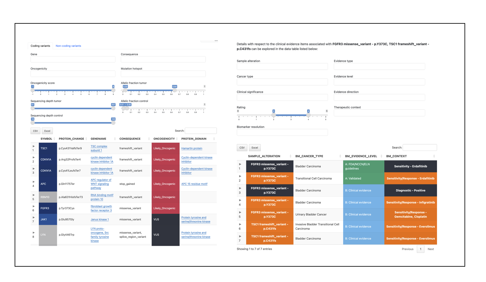

## Personal Cancer Genome Reporter (PCGR) 

### Overview

The Personal Cancer Genome Reporter (PCGR) is a stand-alone software package for translation of individual tumor genomes for precision cancer medicine.

PCGR interprets primarily somatic SNVs/InDels and copy number aberrations, and has additional support for interpretation of bulk RNA-seq expression data. The software produces interactive HTML reports intended for clinical interpretation. PCGR can perform multiple types of analyses, including:

-   Variant classification
    -   according to *oncogenicity*: evaluating the oncogenic potential of somatic DNA aberrations (VICC/CGC/ClinGen guidelines)
    -   according to *actionability*: mapping the therapeutic, diagnostic, and prognostic implications of somatic DNA aberrations (ACMG/AMP guidelines)
-   Tumor mutational burden (TMB) estimation
-   Tumor-only analysis (variant filtering)
-   Mutational signature analysis
-   Kataegis detection
-   Microsatellite instability (MSI) classification
-   RNA expression analysis - outlier detection, similarity analysis, and immune contexture profiling

If you want to interrogate germline variants and their relation to cancer predisposition, we recommend trying the accompanying tool [Cancer Predisposition Sequencing Reporter (CPSR)](https://github.com/sigven/cpsr).

### News

-   *May 2024*: **2.x.x release**
    - Massive reference data bundle upgrade, new report layout, oncogenicity classification++
    - Details at [CHANGELOG](http://sigven.github.io/pcgr/articles/CHANGELOG.html)

-   *February 2023*: **1.3.0 release**
    - Details at [CHANGELOG](http://sigven.github.io/pcgr/articles/CHANGELOG.html)
    - proritize protein-coding BIOTYPE csq ([pr201](https://github.com/sigven/pcgr/pull/201))
    - expose `--pcgrr_conda` option to flexibly activate pcgrr env via a non-default pcgrr name
    - `cpsr_validate_input.py`: refactor for efficient custom gene egrep

-   *November 2022*: **1.2.0 release**
    -    Keep only autosomal, X, Y, M/MT chromosomes
    -    Import bcftools as dependency

-   *October 2022*: **1.1.0 release**

    -   Remove Docker command wrappers
    -   Deprecate `--no_docker` and `--docker_uid` CLI options
    -   Merged PRs [pr192](https://github.com/sigven/pcgr/pull/192), [pr193](https://github.com/sigven/pcgr/pull/193), [pr194](https://github.com/sigven/pcgr/pull/194), [pr196](https://github.com/sigven/pcgr/pull/196).
    -   See [CHANGELOG](http://sigven.github.io/pcgr/articles/CHANGELOG.html) for a few more changes.

-   *May 2022*: **1.0.3 release**

    -   Merged [PR #191](https://github.com/sigven/pcgr/pull/191)

-   *March 2022*: **1.0.2 release**

    -   Fixed [CPSR issue #44](https://github.com/sigven/cpsr/issues/44)

-   *March 2022*: **1.0.1 release**

    -   Fixed bug for huge input sets that cause JSON output crash
        -   huge input variant sets (WGS) are now reduced prior to reporting with R, i.e. exclusion of intronic and intergenic variants, as well as upstream/downstream gene variants ([#178](https://github.com/sigven/pcgr/issues/178)).
    -   Fixed bug for cases where mutational signature analysis reports \> 18 different aetiologies after fitting ([#187](https://github.com/sigven/pcgr/issues/187)).
    -   [CHANGELOG](http://sigven.github.io/pcgr/articles/CHANGELOG.html)

-   *February 2022*: **1.0.0 release**

    -   Complete restructure of Python and R components. Installation now relies on two separate [conda](https://docs.conda.io/en/latest/) packages, `pcgr` (Python component) and `pcgrr` (R component). Direct Docker support remains, with the Dockerfile simplified to rely exclusively on the installation of the above Conda packages. Significant contributon by the great [\@pdiakumis](https://github.com/pdiakumis)
    -   VCF validation step removed. Feedback from users suggested that Ensembl's `vcf-validator` was often too stringent so its use has been deprecated. The `--no_vcf_validate` option remains for backwards compatibility.
    -   New documentation site (<https://sigven.github.io/pcgr>)
    -   Data bundle updates (CIViC, ClinVar, Open Targets Platform, CancerMine, UniProt KB, Pfam)
    -   [CHANGELOG](http://sigven.github.io/pcgr/articles/CHANGELOG.html)

-   *June 30th 2021*: **0.9.2 release**

    -   Data bundle updates (CIViC, ClinVar, CancerMine, UniProt KB, PFAM)
    -   Software upgrades: VEP (104), R v4.1/BioConductor 3.13
    -   **NEW**: TOML configuration removed - all options to PCGR are now command-line based
    -   **NEW**: Feed PCGR with a [CPSR report](https://github.com/sigven/cpsr) to view key germline findings in the tumor report
    -   [CHANGELOG](http://sigven.github.io/pcgr/articles/CHANGELOG.html)
    -   Planned for next release: Support for analysis of RNA fusions

-   *November 30th 2020*: **0.9.1 release**

    -   Data bundle updates (CIViC, ClinVar, CancerMine, UniProt KB)
    -   [CHANGELOG](http://sigven.github.io/pcgr/articles/CHANGELOG.html)

### Example reports

### Getting started

-   [Installation instructions](https://sigven.github.io/pcgr/articles/installation.html)
-   [Run through an example](https://sigven.github.io/pcgr/articles/running.html#example-run)
-   Learn more about
    -   Details regarding [PCGR input files](https://sigven.github.io/pcgr/articles/input.html), and how they should be formatted
    -   How to configure [key settings](https://sigven.github.io/pcgr/articles/running.html)
    -   The types and contents of [PCGR output files](https://sigven.github.io/pcgr/articles/output.html)
    -   The [variant classifications](https://sigven.github.io/pcgr/articles/variant_classification.html) implemented in PCGR
    -   The list of [gene and variant annotation resources](https://sigven.github.io/pcgr/articles/annotation_resources.html) used in PCGR annotation
-   [Frequenty asked questions (FAQ)](https://sigven.github.io/pcgr/articles/faq.html)

### Citation

If you use PCGR, please cite the publication:

Sigve Nakken, Ghislain Fournous, Daniel Vodák, Lars Birger Aaasheim, Ola Myklebost, and Eivind Hovig. **Personal Cancer Genome Reporter: variant interpretation report for precision oncology** (2017). *Bioinformatics*. 34(10):1778--1780. [doi:10.1093/bioinformatics/btx817](https://doi.org/10.1093/bioinformatics/btx817)

## Contact

sigven AT ifi.uio.no
