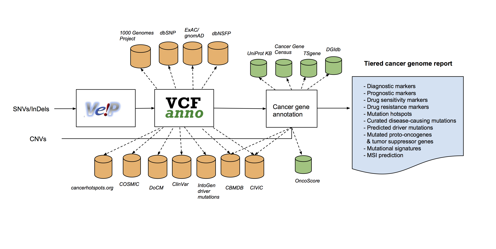

## About

###  What is the Personal Cancer Genome Reporter (PCGR)?

The Personal Cancer Genome Reporter (PCGR) is a stand-alone software package intended for analysis and clinical interpretation of individual cancer genomes. It interprets both somatic SNVs/InDels and copy number aberrations. The software extends basic gene and variant annotations from the [Ensembl’s Variant Effect Predictor (VEP)](http://www.ensembl.org/info/docs/tools/vep/index.html) with oncology-relevant, up-to-date annotations retrieved flexibly through [vcfanno](https://github.com/brentp/vcfanno), and produces HTML reports that can be navigated by clinical oncologists (Figure 1).

### Why use PCGR?

The great complexity of acquired mutations in individual tumor genomes poses a severe challenge for clinical interpretation. There is a general scarcity of tools that can i) systematically interrogate cancer genomes in the context of diagnostic, prognostic, and therapeutic biomarkers, ii) prioritize and highlight the most important findings, and iii) present the results in a format  accessible to clinical experts. PCGR integrates a comprehensive set of knowledge resources related to tumor biology and therapeutic biomarkers, both at the gene and variant level. The application generates a tiered report that will aid the interpretation of individual cancer genomes in a clinical setting.

### Docker-based technology

The PCGR workflow is developed using the [Docker technology](https://www.docker.com/what-docker). The software is thus packaged into isolated containers, in which the installation of all software libraries/tools and required dependencies have been taken care of. In addition to the bundled software, in the form of a Docker image, the workflow only needs to be attached with an [annotation data bundle for precision oncology](annotation_resources.md).
