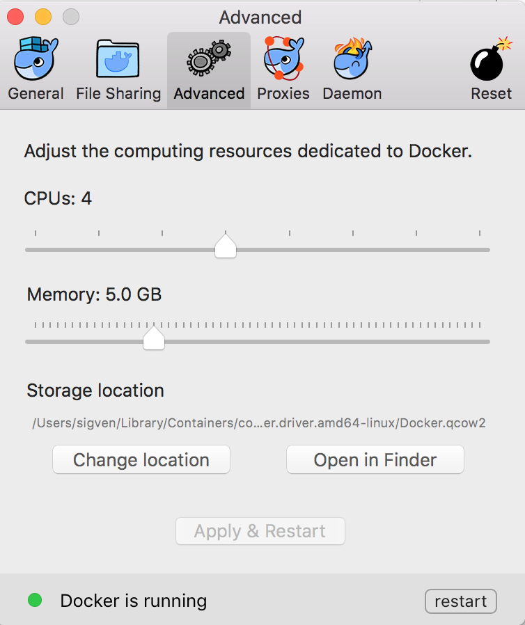

## Getting started

### Prerequisites

#### Installation of Docker

  * Running PCGR requires that Docker is set up on your host. Docker has very complete installation instructions for different platforms:

    - installing [Docker on Linux](https://docs.docker.com/engine/installation/linux/)
    - installing [Docker on Mac OS](https://docs.docker.com/engine/installation/mac/)

  * Check that Docker is running

  * __IMPORTANT__: The following represent the _minimal_ computing resources that must be assigned to the Docker virtual machine:
     * Memory: 5GB
     * CPUs: 4

     For Docker version 1.13 on Mac OSX there is an option to change CPU's and RAM from the UI and restart Docker. This can be found through Docker Preferences (Advanced) in the toolbar:
 
     

 
#### Download PCGR

Below follows step-by-step instructions:

  * Download and unpack the [latest release](https://github.com/sigven/pcgr/releases/tag/v1.2)

  * Download and unpack the data bundle (approx. 17Gb) in the PCGR directory
    * Download [the data bundle](https://drive.google.com/open?id=0B8aYD2TJ472mUFVXcmo1ZXY0OWM) from Google Drive to `~/pcgr-X.X` (replace _X.X_ with the version number)
    * Decompress and untar the bundle, e.g. through the following Unix command: `gzip -dc pcgr.databundle.GRCh37.YYYYMMDD.tgz | tar xvf -`

    A _data/_ folder within the _pcgr-X.X_ software folder should now have been produced

  * Pull the PCGR Docker image from DockerHub:
    * `docker pull sigven/pcgr:latest` (PCGR annotation engine)

#### Test PCGR - generation of clinical report for a cancer genome

A tumor sample report is generated by calling the Python script __run_pcgr.py__, which takes the following arguments and options:

    usage: run_pcgr.py [-h] [--input_vcf INPUT_VCF]
                   [--input_cna_segments INPUT_CNA_SEGMENTS]
                   [--logR_threshold_amplification LOGR_THRESHOLD_AMPLIFICATION]
                   [--logR_threshold_homozygous_deletion LOGR_THRESHOLD_HOMOZYGOUS_DELETION]
                   [--num_vcfanno_processes NUM_VCFANNO_PROCESSES]
                   [--num_vep_forks NUM_VEP_FORKS]
                   pcgr_directory working_directory sample_id

    Personal Cancer Genome Reporter (PCGR) workflow for clinical interpretation of
    somatic nucleotide variants and copy number aberration segments

    positional arguments:
      pcgr_directory        PCGR base directory
      working_directory     Working directory
      sample_id             Tumor sample/cancer genome identifier - prefix for
                        output files

    optional arguments:
      -h, --help            show this help message and exit
      --input_vcf INPUT_VCF
                        VCF input file with somatic query variants
                        (SNVs/InDels) (default: None)
      --input_cna_segments INPUT_CNA_SEGMENTS
                        Somatic copy number alteration segments (tab-separated
                        values) (default: None)
      --logR_threshold_amplification LOGR_THRESHOLD_AMPLIFICATION
                        Log(2) ratio treshold for copy number amplification
                        (default: 0.8)
      --logR_threshold_homozygous_deletion LOGR_THRESHOLD_HOMOZYGOUS_DELETION
                        Log(2) ratio treshold for homozygous deletion
                        (default: -0.8)
      --num_vcfanno_processes NUM_VCFANNO_PROCESSES
                        Number of processes used during vcfanno annotation
                        (default: 4)
      --num_vep_forks NUM_VEP_FORKS
                        Number of forks (--forks) used during VEP annotation
                        (default: 4)

The _examples_ folder contain sample files from TCGA. A report for a colorectal tumor case can be generated through the following command:

`python run_pcgr.py --input_vcf tumor_sample.COAD.vcf.gz --input_cna_segments tumor_sample.COAD.cna.tsv ~/pcgr-X.X ~/pcgr-X.X/examples tumor_sample.COAD`

This command will run the Docker-based PCGR workflow and produce the following output files in the _examples_ folder:

  1. __tumor_sample.COAD.pcgr.html__ - An interactive HTML report for clinical interpretation
  2. __tumor_sample.COAD.pcgr.vcf.gz__ - VCF file with rich set of annotations for precision oncology
  3. __tumor_sample.COAD.pcgr.snvs_indels.tiers.tsv__ - Tab-separated values file with variants organized according to tiers of functional relevance
  4. __tumor_sample.COAD.pcgr.mutational_signatures.tsv__ - Tab-separated values file with estimated contributions by known mutational signatures and associated underlying etiologies
  5. __tumor_sample.COAD.pcgr.snvs_indels.biomarkers.tsv__ - Tab-separated values file with clinical evidence items associated with biomarkers for diagnosis, prognosis or drug sensitivity/resistance
  6. __tumor_sample.COAD.pcgr.cna_segments.tsv.gz__ - Tab-separated values file with annotations of gene transcripts that overlap with somatic copy number aberrations
