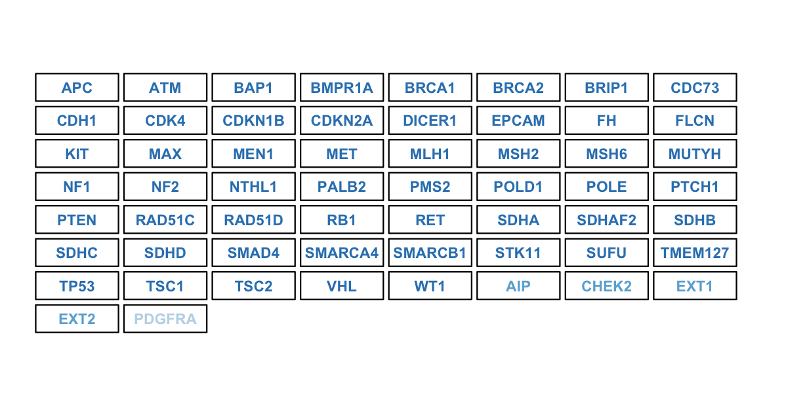

---
title: "Crosstalk filter columns with HTML links - example"
author: "Sigve Nakken"
date: "3/5/2019"
output: 
  html_document:
    code_folding: show  

--- 

```{css, echo=FALSE}
.spoiler {
  visibility: hidden;
}

.spoiler::before {
  visibility: visible;
  content: "Spoiler alert! Hover me to see the answer."
}

.spoiler:hover {
  visibility: visible;
}

.spoiler:hover::before {
  display: none;
}
```

You can insert a message in raw `HTML`:
<p class="spoiler"></p>

A better approach is to use bracketed spans:  
[This is another answer]{.spoiler}


```{r setup, include=FALSE}
knitr::opts_chunk$set(echo = TRUE)
```

## R Markdown - crosstalk filter_select for HTML links

```{r crosstalk_filter, eval = F}
df <- data.frame('entry' = 1, 'value_link' = '<a href=\'http://www.rstudio.com\'>crosstalk1</a>', 'value_raw' = 'crosstalk1', stringsAsFactors = F)
df <- dplyr::bind_rows(df, data.frame('entry' = 2, 'value_link' = '<a href=\'https://www.rstudio.com\'>crosstalk2</a>', 'value_raw' = 'crosstalk2', stringsAsFactors = F))

library(crosstalk)

test_shared <- crosstalk::SharedData$new(df)
crosstalk::bscols(
  list(
    crosstalk::filter_select("TEST", "value_link", test_shared, ~value_link)
  )
)

crosstalk::bscols(
  DT::datatable(test_shared, escape=F,extensions=c("Buttons","Responsive"), width = "100%")
)

```


```{r gene_selection, echo = F, fig.width = 14, fig.height = 8, eval = T}


m <- readRDS("/Users/sigven/research/DB/var_annotation_tracks/data-raw/cancer_predisposition/cancer_predisposition_genes.20190420.rds")
p1 <- pcgrr::gene_selection_tiles(genes = head(m$symbol,127), box_w = 11, box_h = 3, space = 0.5)
p1

```


[spoiler]
```
Example gene panel

```

[/spoiler]

